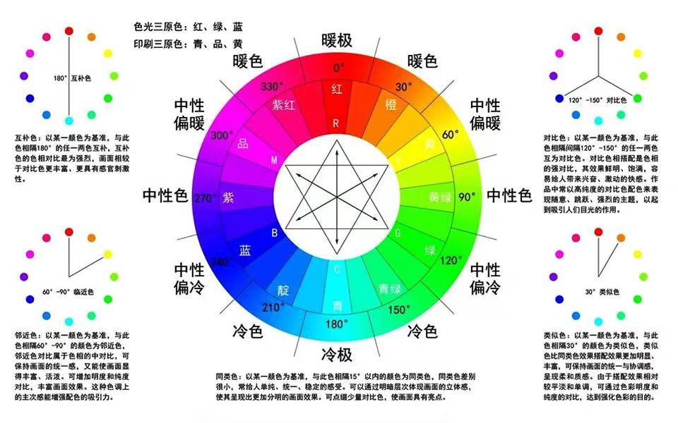

# bcfx

1. 抽象层次和抽象接口参考了[bgfx](https://github.com/bkaradzic/bgfx)
2. 独立的渲染线程异步执行抽象渲染指令

## 问题记录

1. Windows 下不支持空`struct`定义
2. Windows 下需要针对不同的`OpenGL Context`创建不同的`vertex array object`
3. MacOSX 仅支持`OpenGL 3.2`或之上版本的`forward-compatible core profile context`，该模式下必须使用`vertex array object`来进行渲染

## BCFX 逻辑框架：

### 坐标系

1. 局部空间: 本质上任意三维坐标系都可以做局部坐标系（根据需要构造出局部坐标系到世界坐标系的变换矩阵）
2. 世界空间: 定义为 +x 向右、 +y 向前、 +z 向上，属于右手坐标系
3. OpenGL 视角空间: +x 向右、 +y 向上、 +z 向后，也属于右手坐标系
4. OpenGL 特有的 CubeMap 坐标系: +x 向右、 +y 向下、 +z 向后，我们看向 -z 轴，属于左手坐标系

### 库 API：

1. 生命周期：初始化 init、每一帧调用 apiFrame、结束 shutdown
2. 创建或销毁渲染资源：Layout、VertexBuffer、IndexBuffer、Shader、Program
3. 操作 View 缓冲区：View 渲染的目标窗口、大小、Clear 参数
4. 提交 DrawCall：Vertex、Index、Program、对应的 ViewID

### 逻辑线程与渲染线程的交互：

1. 初始化 init 的时候直接创建渲染线程，并开始等待逻辑线程的 sem
2. 逻辑线程提交创建资源的请求命令，此时只是加到 submitFrame->CommandBuffer 中
3. 逻辑线程设置目标 View 的状态，此时只是保存在当前 Context 的缓冲中
4. 逻辑线程设置 DrawCall 参数，由 encoder 将参数缓存起来
5. 逻辑线程通过 submit 提交 DrawCall，此时由 encoder 将所有参数打包放到 submitFrame 的缓冲中
6. 所有 DrawCall 提交完毕之后，逻辑线程调用 apiFrame 标志着这一帧提交完毕，此时会把当前 Context 的所有 View 复制一份到 submitFrame 中，将 submitFrame 和 renderFrame 互换，并 post 逻辑线程的 sem 触发渲染线程开始渲染

### 逻辑层的抽象：

1. 所有渲染资源都抽象成一个 Handle，本质是一个内部维护数组的下标
2. View：一个 View 表示一个画布，用来承载一部分 DrawCall 可以共享的渲染参数，包括 RenderTarget、Viewport、Clear 参数、ViewMatrix 等
3. DrawCall：DrawCall 肯定会隶属于某一个 View，用于表示一个物体的渲染参数，包括 VertexBuffer、IndexBuffer、Program 等

### 渲染 API 的抽象：

1. 生命周期：init、shutdown
2. 创建或销毁渲染资源：Layout、VertexBuffer、IndexBuffer、Shader、Program
3. 处理一帧的所有 DrawCall：begin、end、submit、flip

## 关于 OpenGL

1. glViewport 指定的是后续 DrawCall 中 NDC 映射过来对应的 FrameBuffer 大小（左下角为原点，X 正向右，Y 正向上，单位是像素）
2. glScissor 指定的是渲染裁剪框，glEnable 了 GL_SCISSOR_TEST 之后，只有在这个方框内的像素会被修改（左下角为原点，X 正向右，Y 正向上，单位是像素）
3. glClear 本质是一个修改 FrameBuffer 像素数据的操作，默认是 Clear 整个 FrameBuffer，受 Scissor 控制
4. glfw 处理的窗口事件中，给到的坐标是基于屏幕坐标（不是像素坐标），并且，左上角为原点，X 正向右，Y 正向下。因此要注意，传递给 OpenGL/BCFX 的坐标需要使用 FrameBufferSize 之类的像素版本，并且，处理原点和 Y 正方向不一致的问题

## Shader 功能

1. 支持以`#pragma include<xxx/xx.xxxx.glsl>`的方式来使用类似 C 语言`#include`预处理的功能
2. 支持以`#pragma header start`、`#pragma header finish`的方式来编写函数声明

## 关于色环

1. 光的三原色：红、绿、蓝（red、green、blue）
2. 颜料的三原色：青、品红(洋红)、黄（cyan、magenta、yellow）
3. `红与青`、`绿与品红`、`蓝与黄`互为互补色
4. 黑、白（black、white）
5. 紫（purple）（蓝 + 品红）
6. 橙（orange）（红 + 黄）
7. 黄绿（chartreuse）（绿 + 黄）
8. 靛（dian，四声）（indigo）（蓝 + 青）
9. 青绿（turquoise）（绿 + 青）
10. 紫红色（fuchsia）（红 + 品红）
